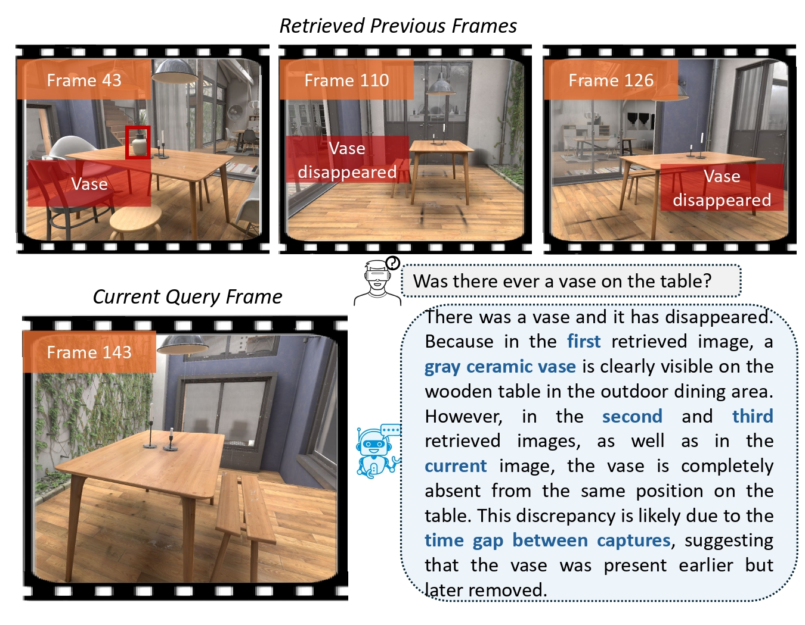

# ObjChangeVR

This repository accompanies the paper **“ObjChangeVR: Object State Change Reasoning from Continuous Egocentric Views in VR Environments”** to appear at EACL 2026. The code implements the complete ObjChangeVR pipeline, including dataset construction, object change reasoning, and evaluation.

---

## Outline




* [I. ObjChangeVR-Dataset](#1)
  
  Unity-based data export and QA benchmark generation.

- `method/`  
  Core ObjChangeVR pipeline and evaluation code.

---


## ObjChangeVR-Dataset <span id="1">

The dataset can be downloaded [**here**]()

All code assumes the following **dataset layout**:

```
dataset/
├── villaInterior/
│   ├── 1/
│   │   ├── compressed/
│   │   ├── disappear_object/
│   │   ├── path/
│   │   ├── screenshot/
│   │   │   ├── data.csv
│   │   │   ├── after/
│   │   │   ├── before/
│   │   │   └── compressed/
│   │   ├── groundtruth/
│   │   │   ├── data.csv
│   │   │   ├── before/
│   │   └── └── after/
│   ├── 2/
│   └── ...
├── restaurant/
├── market/
├── museum/
└── village/
```

- Each **numeric folder** represents a **single independent trajectory**.

---

### ObjChangeVR-Dataset Generation

Unity scripts are located in:

```
dataset_construction/export_unity/
```

#### C# Scripts

- `CameraPathRecorder.cs`  
  Records camera trajectories and screenshots.

- `CameraPathPlayer.cs`  
  Replays recorded camera trajectories.

- `FlyCamera.cs`  
  Provides free camera control (recording only).

#### Installation Rules

- `CameraPathRecorder.cs` and `CameraPathPlayer.cs` are **mutually exclusive**.  
  **Only one may be active per Unity scene/session.**

- `FlyCamera.cs` **must be attached together with** `CameraPathRecorder.cs`.

- `CameraPathPlayer.cs` does **not** require `FlyCamera.cs`.

---

### QA Benchmark Generation

Generate QA pairs using VLM:

```bash
python dataset_construction/generate_qa.py
```

The dataset includes egocentric frames stored in the `groundtruth/after/` and `screenshot/after/` directories, along with generated question–answer pairs (`generated_QA.csv`) generated from these frames.

---

## ObjChangeVR Pipeline

The pipeline is implemented in:

```
python method/method.py
```

For each trajectory, a `results.csv` file is provided. This file records the final generated answer (`GeneratedAnswer`), the intermediate answers produced during reasoning (`Sub_Answers`), and the indices of retrieved frames used to generate the answer (`RetrievedIndices`).

## Evaluation

Evaluation code is provided in:

```
python method/evaluation.py
```

We evaluate the model using Strict Exact Match (EM), EM@τ (τ = 0.8 by default), and class-level F1 scores (with the `disappeared`, `never`, and `always been there` categories). Evaluation results are reported for scenes with shorter trajectories, scenes with longer trajectories, and for all trajectories combined.

---

## Citation

If you use ObjChangeVR in academic work, please cite:

```bibtex
@inproceedings{ObjChangeVR,
  title={ObjChangeVR: Object State Change Reasoning from Continuous Egocentric Views in VR Environments},
  author={Ding, Shiyi and Wu, Shaoen and Chen, Ying},
  booktitle={Proceedings of the European Chapter of the Association for Computational Linguistics (EACL)},
  year={2026}
}
```
---

## Acknowledgments
The authors of this repository are Shiyi Ding and Ying Chen. Contact information is as follows:
* [Shiyi Ding](https://www.linkedin.com/in/shiyi-ding-120900325/) (shiyiddd@gmail.com)
* [Ying Chen](https://yingchen115.github.io/bio/) (yingchen@psu.edu)

This work was supported in part by NSF grant No. 2550742.
