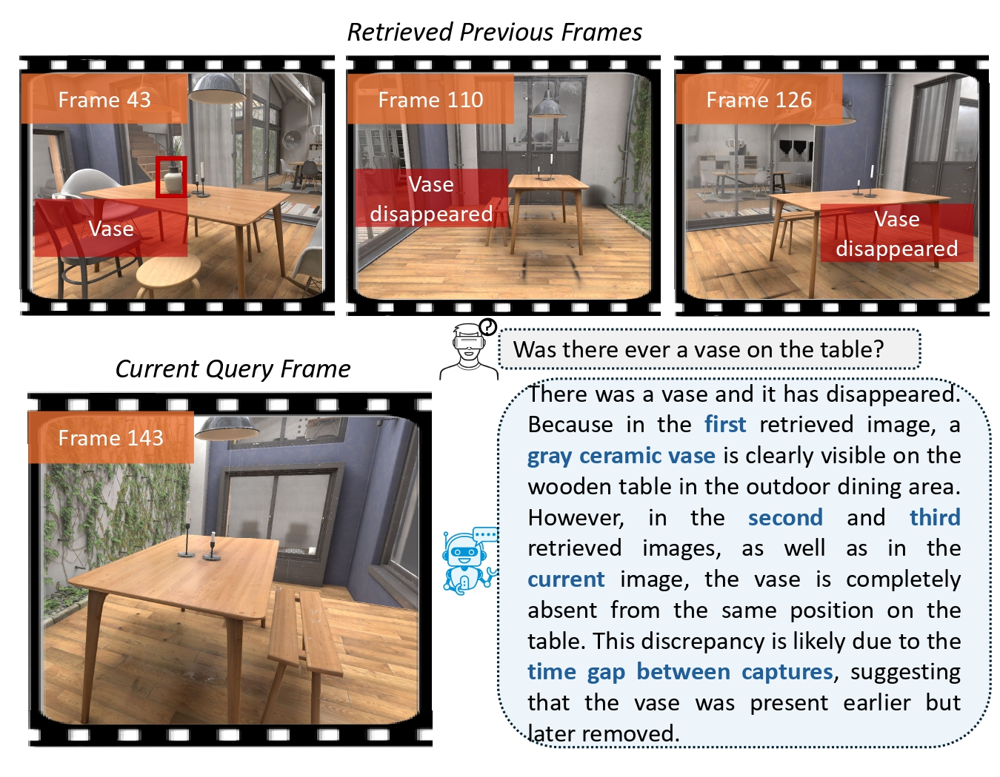

# ObjChangeVR

This repository accompanies the paper **“ObjChangeVR: Object State Change Reasoning from Continuous Egocentric Views in VR Environments”** to appear at EACL 2026. The code implements the complete ObjChangeVR pipeline, including dataset construction, object change reasoning, and evaluation.

---

## Outline




* [I. ObjChangeVR-Dataset](#1)
* [II. ObjChangeVR-Dataset Generation](#2)
* [III. ObjChangeVR Pipeline](#3)
* [IV. Evaluation](#4)
  
## I. ObjChangeVR-Dataset <span id="1">

The dataset can be downloaded [**here**](https://pennstateoffice365-my.sharepoint.com/:u:/g/personal/yfc5578_psu_edu/IQB7trduxN_rT4sHdsU-EyoFAVKw1kG8nTksqoLPlq7eMfw?e=Ajwakl)

The **dataset layout** is as follows:

```
dataset/
├── villaInterior/
│   ├── generated_QA.csv
│   ├── 1/
│   │   ├── disappear_object/
│   │   ├── path/
│   │   ├── screenshot/
│   │   │   ├── data.csv
│   │   │   ├── after/
│   │   │   └── before/
│   ├── 2/
│   └── ...
├── restaurant/
├── market/
├── museum/
└── village/
```

Each numeric folder represents a single independent trajectory. `screenshot/before/` stores images captured before object disappearance. `screenshot/after/` stores images captured after object disappearance.

---

## II. ObjChangeVR-Dataset Generation <span id="2">

Due to licensing restrictions (the scenes used for testing are purchased from the Unity Asset Store and cannot be redistributed), this repository contains only the C# and Python scripts used to generate the dataset, not the complete Unity scenes. 

The C# scripts Unity scripts are located in `dataset_construction/export_unity/`. They are tested in Unity 2022.3.52f1.

### Unity Project Setup

#### Recording Mode Setup

1. In Unity, open or import a scene to work with. For example, [Villa Inteorior](https://assetstore.unity.com/packages/3d/environments/urban/archvizpro-interior-vol-6-urp-274067), [Restaurant](https://assetstore.unity.com/packages/essentials/tutorial-projects/fast-food-restaurant-kit-239419), [Market](https://assetstore.unity.com/packages/3d/environments/low-poly-medieval-market-262473), [Museum](https://assetstore.unity.com/packages/3d/environments/historic/historical-museum-251130), and [Viking Village](https://assetstore.unity.com/packages/essentials/tutorial-projects/viking-village-29140).
2. Create or select your camera GameObject in the Unity Hierarchy.
3. Attach scripts to the camera GameObject:
   - `FlyCamera.cs`
   - `CameraPathRecorder.cs`
4. Configure CameraPathRecorder in the Inspector:
   - Camera Transform: Drag your camera's Transform here.
   - Record Interval: Time between recordings (default: 0.2s).
   - Save File Name: Output filename (default: "camera_path.json").
5. Enter Play Mode and fly around your scene using the controls.
6. Exit Play Mode and the path will be automatically saved.

#### Playback Mode Setup

1. Remove or disable `FlyCamera.cs` and `CameraPathRecorder.cs`.
2. Attach `CameraPathPlayer.cs` to the camera GameObject.
3. Configure CameraPathPlayer in the Inspector:
   - Camera Transform: Drag your camera's Transform here.
   - Playback Camera: Drag your Camera component here.
   - Load File Name: Path to load (default: "camera_path.json").
   - Capture Every N Frames: Screenshot frequency (default: 2).
   - Num To Disappear: Number of objects to hide (default: 250).
   - Disappear Duration: Time before objects reappear (default: 1000s).
   - Trigger At Fraction: When to trigger disappearance (default: 0.6 = 60% through path).
4. Tag objects you want to disappear with the tag `"disappear"`.
5. Enter Play Mode and playback will start automatically.

#### Output Data

1. CSV file. Each run generates a data.csv file containing the index (screenshot number), timestamp (capture time), screenshot filename (PNG file), position (camera x, y, z coordinates), rotation (camera quaternion), and for ground truth runs only, an IsDisappear flag (0 for before disappearance, 1 for after).

2. JSON files
   - `camera_path.json`: Array of camera poses
   - `disappear_*.json`: Record of which objects disappeared and when

3. Images.
The system requires two playback runs (in **Playback Mode**) to create paired image datasets. The first run saves screenshots to `record/screenshot/` where objects disappear partway through. The second run saves screenshots to `record/groundtruth/` where all objects remain visible throughout the entire path. Both runs follow the exact same camera path, so each screenshot from the first run has a matching screenshot from the second run taken from the identical position. This creates paired datasets where you can compare images with objects missing (from run 1) against images with all objects present (from run 2) at the same camera positions.

#### QA Benchmark Generation

Generate QA pairs using:

```bash
python dataset_construction/generate_qa.py
```

This takes in egocentric frames stored in the `groundtruth/after/` and `screenshot/after/` directories, to generated question–answer pairs (`generated_QA.csv`) from these frames.

---

## III. ObjChangeVR Pipeline <span id="3">

*Dependencies:* `pandas`, `numpy`, `Pillow`, `openai`.

The pipeline is implemented in:

```
python method/method.py
```

For each trajectory, a `results.csv` file is provided. This file records the final generated answer (`GeneratedAnswer`), the ground-truth answer (`answer`), the intermediate answers produced during reasoning (`Sub_Answers`), and the indices of retrieved frames used to generate the answer (`RetrievedIndices`).

## IV. Evaluation <span id="4">

*Dependencies*: `pandas`, `openpyxl`.

Evaluation code is provided in:

```
python method/evaluation.py
```

We evaluate the model using Strict Exact Match (EM), EM@τ (τ = 0.8 by default), and class-level F1 scores (with the `disappeared`, `never`, and `always been there` categories). Evaluation results are reported for scenes with shorter trajectories, scenes with longer trajectories, and for all trajectories combined.

---

## Citation

If you use ObjChangeVR in academic work, please cite:

```bibtex
@inproceedings{ObjChangeVR,
  title={ObjChangeVR: Object State Change Reasoning from Continuous Egocentric Views in VR Environments},
  author={Ding, Shiyi and Wu, Shaoen and Chen, Ying},
  booktitle={Proceedings of the European Chapter of the Association for Computational Linguistics (EACL)},
  year={2026}
}
```
---

## Acknowledgments
The authors of this repository are Shiyi Ding and Ying Chen. Contact information is as follows:
* [Shiyi Ding](https://www.linkedin.com/in/shiyi-ding-120900325/) (shiyiddd@gmail.com)
* [Ying Chen](https://yingchen115.github.io/bio/) (yingchen@psu.edu)

This work was supported in part by NSF grant No. 2550742.

